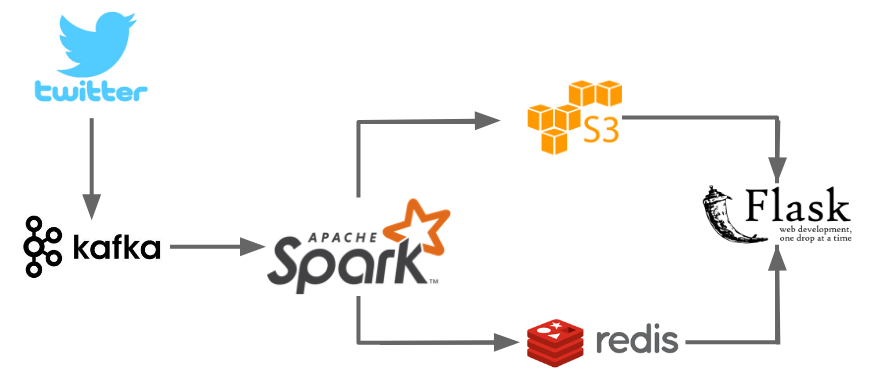

# What's Hot? - A framework of real time twitter stream analysis
2018 Insight Data Engineer Project

## Table of Content
[Overview] 

### Overview
This data pipeline comsumes real time twitter data and does semantic analysis on hashtags.

### Pipeline

